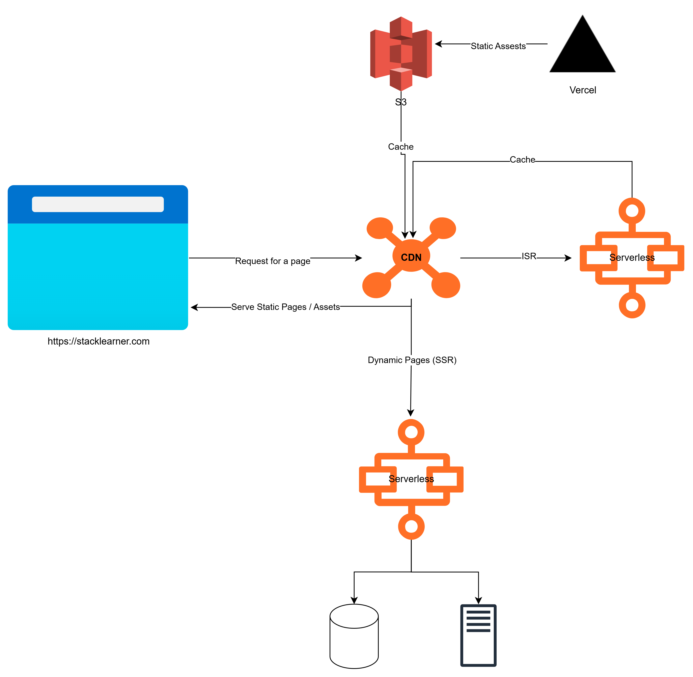

Client side rendering cors 

* Long initial load time
* SEO(Search Engine Optimization) is not good
* Syncing state between server and client
* Need different strategies for caching

Server side rendering

* Server render the html and send it to the client along with the javascript
* Browser will take over the rendering
  * Will rehydrate the javascript for the client side rendering so it will be interactive
  * Will reconcile the state so that the client side rendering will be in sync with the server side rendering

But it is difficult to manually add server side rendering to an existing client side rendering app that's why Next.js 
came to the rescue. Next.js is a framework that allows you to add server side rendering to your react app with
minimal effort.

# Next.js
Next.js provide routing, layout, and other features that are not available in react. It also provide server side
rendering, static site generation, incremental static regeneration and partial pre rendering.

## SSG(Static Site Generation)
Best for blogs, marketing pages, documentation, terms and conditions, privacy policy, about us, contact us, etc site
where the content doesn't change often, like content added, deleted, or updated once a day or once a week or once a 
month.

If in a next.js page there is no api call, async call, or any dynamic data, search params, query params, dynamic routing, 
getServerSideProps, state, or any other dynamic data, then next.js will generate the html at build time, will store in
CDN(Content Delivery Network) and will serve the static html to the client.

* Generate the html at build time
* Serve the static html to the client
* Can be cached by a CDN(Content Delivery Network) for better performance

## ISR(Incremental Static Regeneration)
We can add revalidation date while fetching the data in getStaticProps. If the data is older than the revalidation date
then next.js will re-generate the html in the background after a certain period of time.

Combination of SSG and SSR. Ideal for pages where does not need fresh data on each request but need fresh data after a
certain period of time, like news, weather etc.

* Generate the html at build time
* Serve the static html to the client
* Re-generate the html in the background after a certain period of time
* Faster than SSR because the server has already generated the html

### APP Router
```ts
// app/posts/[id]/page.tsx
import { notFound } from 'next/navigation';

interface PostProps {
  params: { id: string };
}

export async function generateStaticParams() {
  // Fetch all possible IDs
  const res = await fetch('https://jsonplaceholder.typicode.com/posts');
  const posts = await res.json();

  return posts.map((post: { id: string }) => ({
    id: post.id.toString(),
  }));
}

export const revalidate = 60; // Revalidate every 60 seconds

export default async function PostPage({ params }: PostProps) {
  const res = await fetch(
    `https://jsonplaceholder.typicode.com/posts/${params.id}`,
    { next: { revalidate: 60 } }
  );

  if (!res.ok) {
    notFound();
  }

  const post = await res.json();

  return (
    <div>
      <h1>{post.title}</h1>
      <p>{post.body}</p>
    </div>
  );
}
```

### Page Router
```ts
// pages/posts/[id].js
import { useRouter } from 'next/router';

export async function getStaticPaths() {
  const res = await fetch('https://jsonplaceholder.typicode.com/posts');
  const posts = await res.json();

  const paths = posts.map((post) => ({
    params: { id: post.id.toString() },
  }));

  return { paths, fallback: 'blocking' };
}

export async function getStaticProps({ params }) {
  const res = await fetch(
    `https://jsonplaceholder.typicode.com/posts/${params.id}`
  );

  if (!res.ok) {
    return {
      notFound: true,
    };
  }

  const post = await res.json();

  return {
    props: { post },
    revalidate: 60, // Revalidate every 60 seconds
  };
}

export default function PostPage({ post }) {
  const router = useRouter();

  if (router.isFallback) {
    return <div>Loading...</div>;
  }

  return (
    <div>
      <h1>{post.title}</h1>
      <p>{post.body}</p>
    </div>
  );
}
```

#### Comparison

| Feature              | SSG                                               | ISR                              |
|----------------------|---------------------------------------------------|----------------------------------|
| ISR Implementation   | `revalidate` in `fetch` or `generateStaticParams` | `revalidate` in `getStaticProps` |
| Dynamic Routing      | File-based dynamic routes `[id]`                  | File-based dynamic routes `[id]` |
| Fallback Behavior    | `notFound()`	                                    | `fallback` in `getStaticPaths`   |

## SSR(Server Side Rendering)
Ideal for pages requiring fresh data on each request, like dashboard, products page etc.

* Generate the html on each request at the server
* Serve the html, along with the javascript, to the client
* SEO(Search Engine Optimization) is good
* Slow initial load time because the server has to generate the html on each request than SSG or ISR

## CSR(Client Side Rendering)

* Generate the html on the client
* Serve javascript to the client that will generate the html on the client

## PPR(Partial Pre Rendering)
In this stategy, some parts of the page are pre-rendered at build time and some parts are rendered at server side or 
at client side.

Ideal for pages where some parts of the page are static and some parts are dynamic, like header, footer, sidebar,
navigation, etc are static and the main content is dynamic. Or logged-in user information, cart information, etc are
dynamic and other parts of the page are static.

For e-commerce product description, price, image etc are rarely changed so they can be pre-rendered at build time and
stock availability, discount, etc are dynamic so they can be rendered at server side or at client side.

Need to change configuration in next.config.js as it is experimental feature
```ts
import type { NextConfig } from 'next'

const nextConfig: NextConfig = {
    experimental: {
        ppr: 'incremental',
    },
}

export default nextConfig
```
In page component
```ts
import { Suspense } from 'react'
import { StaticComponent, DynamicComponent, Fallback } from '@/app/ui'

export const experimental_ppr = true

export default function Page() {
    return (
        <>
            <StaticComponent />
        <Suspense fallback={<Fallback />}>
    <DynamicComponent />
    </Suspense>
    </>
)
}
```

| **Feature**               | **App Router (ISR with PPR)**                       | **Page Router (ISR with PPR)**                |
|---------------------------|-----------------------------------------------------|-----------------------------------------------|
| **Configuration**         | `export const revalidate = <seconds>`               | `revalidate` in `getStaticProps`              |
| **Dynamic Path Handling** | `generateStaticParams`                              | `getStaticPaths`                              |
| **Fallback Handling**     | `notFound()` for missing paths                      | `fallback` in `getStaticPaths`                |
| **ISR Fetching**          | `fetch(url, { next: { revalidate: <seconds> } })`   | Automatically handled in `getStaticProps`     |


## How vercel serve a Next.JS request?



Image Source: [Thinking in NextJS](https://www.stacklearner.com/my/workshops/thinking-in-nextjs?wid=18dd4467-6515-4d68-a7a1-6a5748c69054)

### Overview

When a page in a Next.js application uses **Server-Side Rendering (SSR)**, the HTML is generated on the server and 
stored in the CDN (Content Delivery Network). CDNs like Amazon S3, Cloudflare, or others cache the content. Metadata 
generated at build time helps the edge network/CDN decide whether to serve the request from the CDN cache or to forward
it to the server for fresh JavaScript generation.

### Request Handling

1. **Initial Request**:
  - A request is made to the nearest Vercel edge server/CDN server.
  - The edge network/server determines how to handle the request.

2. **Edge Network/CDN**:
  - Serves content from the nearest edge server to the client.

---

### Scenarios

#### 1. **Static Request**:
- If the data is static, the CDN serves the static HTML directly to the client.

#### 2. **Simple Tasks**:
- For tasks that can be handled by the edge server, the request is served directly from the **Edge Runtime**.
- The Edge Runtime is less powerful than Node.js runtime but suitable for lightweight operations like:
  - Sending emails
  - Making HTTPS requests
  - Queuing jobs

#### 3. **Complex Tasks / Dynamic HTML**:
- For complex tasks that cannot be handled by the edge server, the request is forwarded to a **Serverless Function**.
- The Serverless Function generates the required response.

---

### Serverless Functions

- **Definition**: Lightweight, on-demand functions that run on the server.
- **Runtime**: Supports Node.js runtime.
- **Lifecycle**:
  - Created dynamically upon request.
  - Destroyed after task completion.
- **Performance**:
  - Initialization takes 30ms to 500ms.
  - Suitable for short-running tasks.
  - Not recommended for long-running operations, as Vercel imposes restrictions on such use cases.
- **Use Cases**:
  - Handling dynamic content.
  - Performing server-side computations.


To make this things happen smoothly and optimize the application for maximum performance, NextJS needs engineering in
several places. Such as,

* Complex Build System => NextJS manages this
* Serverless Functions => Vercel manages this
* Edge Runtime => Vercel manages this
* Global CDN => Vercel manages this
* Caching => NextJS + Vercel work together to manage this
* File System Based Routing => NextJS manages this
* Application Configurations => We take those decision
* Boundaries => We take those decision

## The Three-Step Process in Next.js Deployment

### Step 1: Application

- **Design the Application**: Structure and design your application based on requirements.
- **Write Necessary Code**: Implement the features and functionalities using React and Next.js.
- **Setup Boundaries**: Define the application's constraints and what it will and won't do.
- **Add Necessary Configurations**: Configure Next.js settings such as routing, environment variables, and other project
  settings.

---

### Step 2: Build

- **Resolve Routes**: Next.js resolves and maps routes based on the `pages/` or `app/` directory.
- **Generate Static Pages**:
  - For **Static Site Generation (SSG)** and **Incremental Static Regeneration (ISR)**.
  - Static content is prepared at build time for better performance.
- **Code Splitting and Bundling**: Automatically splits the code and bundles it to optimize loading performance.
- **Middleware Compilation**: Middleware logic is compiled to handle specific requests dynamically at runtime.
- **Generate Metadata**: Generates metadata for efficient caching and routing across the infrastructure.

---

### Step 3: Infrastructure

- **Managed by Infrastructure**:
  - Most backend tasks like scaling, caching, and routing are handled automatically.
- **Vercel as Infrastructure Provider**:
  - Vercel hosts and manages the application with optimized performance.
- **Custom Infrastructure**:
  - You can also set up your own infrastructure if Vercel isn't being used.

---

### Additional Notes

- **Vercel's Role**:
  - Provides seamless integration with Next.js.
  - Optimized for Static Site Generation (SSG) and Incremental Static Regeneration (ISR).
  - Leverages CDNs for serving static content and serverless functions for dynamic tasks.
- **Infrastructure Flexibility**:
  - While Vercel is a popular choice, Next.js can also be deployed on other platforms like AWS, Google Cloud, or 
    self-hosted servers.


## Decision Making in Next.js Engineering

### Routing Patterns
1. **Nested Routing**:
  - Used for components like tabs, accordions, etc., where caching the component is beneficial.
2. **Parallel Routing**:
  - Commonly used in dashboards to display multiple independent sections simultaneously.
3. **Intercepting Routing**:
  - Useful when building components that are reused across multiple pages.

---

### Layout Design
Proper layout design is critical for improving page load time and overall user experience.
- **Efficient Loading**:
  - Avoid loading all components after fetching all necessary data.
  - Implement skeleton loading for components while data is being fetched.
  - Show components immediately as their data is resolved.
- **API Call Strategies**:
  - Use `Promise.all` to make parallel API calls for better performance.
  - Sequential API calls when dependencies exist between requests.
- **Importance**:
  - Layout design plays a crucial role in performance and concurrency.
  - Focus on:
    - Setting boundaries for components.
    - Leveraging **Client-Server Composition** for dynamic and static rendering.

---

### Rendering Strategies

1. **Static Content**:
  - Use **Static Site Generation (SSG)** for content that doesn’t change frequently.
2. **Dynamic Content**:
  - **Server-Side Rendering (SSR)**: For fresh data on every request.
  - **Incremental Static Regeneration (ISR)**: For content updated periodically.
  - **Partial Pre-Rendering (PPR)**: Combines static and server-side rendering for hybrid content.
  - **Client-Side Rendering (CSR)**: For client-only rendering.
---

### Caching Strategies

- **Where to Cache**:
  1. At the API route level.
  2. Use **HTTP Cache** for browser-level caching.
  3. Implement **LRU Cache** at the middleware level for efficient caching of frequently accessed data.
---

### Runtime Options
Pages can run on either **Edge** or **Node.js** runtimes. Choose the runtime based on the performance requirements and
rendering strategy.
- **Edge Runtime**:
  - For lightweight and latency-sensitive tasks.
- **Node.js Runtime**:
  - For more complex, server-side logic.

---

### Key Considerations
- Match the routing pattern and layout strategy to the application's requirements.
- Use appropriate rendering strategies based on the content's nature (static or dynamic).
- Leverage caching effectively at different levels to optimize performance.
- Choose the correct runtime (Edge or Node.js) for each page or API route.


# Types of Components in Next.js

# Client Components

- **Hydration** happens on the client side.
- Can use all React features.
- Has access to the **browser API**.
- Can manage **local states** and interactivity.
- **Loses all server-side features**.
- Client page **cannot use `async/await`**.
- Cannot use `metadata` but can add metadata inside JSX directly (React 19).

## Behavior

In client components, Next.js pre-renders some HTML on the server side and sends it to the client. The client then takes over rendering, allowing content to display before JavaScript is fully loaded.

### Example: Using "use-client" Directive

For the following example, Next.js server sends `Users: 0` in the HTML to the client we can verify this at view page source. But as React starts rendering, you will see `Loading users...` while the API call is in progress.

#### Types

```ts
type Address = {
  street: string;
  suite: string;
  city: string;
  zipcode: string;
  geo: Geo;
};

type Geo = {
  lat: string;
  lng: string;
};

type Company = {
  name: string;
  catchPhrase: string;
  bs: string;
};

type User = {
  id: number;
  name: string;
  username: string;
  email: string;
  address: Address;
  phone: string;
  website: string;
  company: Company;
};
```

#### Component Example

```tsx
'use client';

import { useEffect, useState } from 'react';

export default function Users() {
  const [users, setUsers] = useState<User[]>([]);
  const [loading, setLoading] = useState(false);

  const fetchUsers = async () => {
    const controller = new AbortController();
    setLoading(true);
    try {
      const response = await fetch(
        'https://jsonplaceholder.typicode.com/users',
        {
          signal: controller.signal,
        }
      );
      const data = (await response.json()) as User[];
      setUsers(data);
    } catch (error) {
      if (error instanceof Error && error.name === 'AbortError') {
        console.log('Fetch aborted');
      } else {
        console.error('Error fetching users:', error);
      }
    } finally {
      setLoading(false);
    }

    return controller;
  };

  useEffect(() => {
    const controller = fetchUsers();

    return () => {
      controller.then((ctrl) => ctrl.abort());
    };
  }, []);

  if (loading) {
    return <div>Loading users...</div>;
  }

  return <div>Users: {users.length}</div>;
}
```

---

### Issue with Default Server Component Behavior

If a component is not explicitly declared as a client component, it defaults to a server component. This means that at build time, Next.js caches the rendered output. For example:

```tsx
export default function HomePage() {
  return (
    <div>
      <h1 className="text-2xl font-bold">
        Home Page: {new Date().toLocaleString()}{' '}
      </h1>
    </div>
  );
}
```

### Production Behavior

In production:
- The page will display the **build-time timestamp** every time it renders.
- Viewing the **response headers** will show `X-Next-Cache: HIT`, meaning the page is cached and served from the CDN.

#### Fix: Convert to Client Component

To fix this, declare the component as a client component:

```tsx
'use client';

export default function HomePage() {
  return (
    <div>
      <h1 className="text-2xl font-bold">
        Home Page: {new Date().toLocaleString()}{' '}
      </h1>
    </div>
  );
}
```

### Example: Default Client-Side Behavior in `pages/`
In `pages` directory, all components are client components by default. This means that the following code will render
the current time on each page load:

```tsx
// pages/homePage.js
export default function HomePage() {
  return (
    <div>
      <h1 className="text-2xl font-bold">
        Home Page: {new Date().toLocaleString()}{' '}
      </h1>
    </div>
  );
}
```

### Example: Dynamic Rendering with `dynamic()`
We can use `next/dynamic` function to dynamically import a component and explicitly set it to client-side rendering with
the `ssr: false` option.

```tsx
import dynamic from 'next/dynamic';

const ClientOnlyComponent = dynamic(() => import('./ClientComponent'), {
  ssr: false,
});

export default function Page() {
  return (
    <div>
      <ClientOnlyComponent />
    </div>
  );
}
```

### Example: Browser APIs Automatically Trigger Client Rendering
If a component directly references a browser API (e.g., `window`, `document`), Next.js treats it as a client-rendered
component since such APIs are not available on the server.

```tsx
export default function BrowserAPIComponent() {
  if (typeof window !== 'undefined') {
    console.log('This code runs on the client side');
  }

  return <div>Browser API detected</div>;
}
```

### Example: Using `useEffect`, `useState`, and `useRef`
When a component uses `useEffect`, `useState`, or `useRef`, it inherently requires client-side rendering because
`useEffect` runs after the component mounts on the client, `useState` manages dynamic reactivity, and `useRef` allows
direct DOM manipulation or storing mutable values tied to the browser environment.

```tsx
import { useEffect, useState, useRef } from 'react';

export default function ExampleComponent() {
  const [count, setCount] = useState(0); // State for client-side rendering
  const ref = useRef(null); // Reference to a DOM element

  useEffect(() => {
    console.log('This runs only on the client after component mounts');
    if (ref.current) {
      ref.current.style.color = 'blue'; // Manipulate DOM element
    }
  }, []); // Empty dependency array ensures it runs once after mounting

  return (
          <div>
            <h1 ref={ref}>Client-side logic example</h1>
            <p>Count: {count}</p>
            <button onClick={() => setCount(count + 1)}>Increment</button>
          </div>
  );
}

```

---

# Server Components

- Hydration does not occur in server components.
- If you can view the HTML content of a page in the page source, it is server-rendered.
- By default, all components in Next.js are **server components**.

---

## Rendering Types in Server Components

## Static Rendering

### Static
- Fully static content with no dynamic data.

### SSG (Static Site Generation)
- Pre-rendered at build time.
- In development mode, the `X-Next-Cache` header will not be shown.
- In production mode, the `X-Next-Cache: HIT` header will be visible, indicating the page is cached in the CDN.
- The cached content is served unless revalidated.

### ISR (Incremental Static Regeneration)
- Periodic updates to static pages after a specified revalidation interval.
- Example: Adding `revalidate` to a page component makes it ISR.

```tsx
import Link from 'next/link';
import type { Post } from '@/types/post';

export const revalidate = 60;

export default async function PostsPage() {
  const posts = await fetch('https://jsonplaceholder.typicode.com/posts').then(
    (res) => res.json() as Promise<Post[]>
  );

  return (
    <div>
      <h1 className='text-2xl font-bold'>Posts</h1>
      <p>Time: {new Date().toLocaleTimeString()}</p>
      <ul className='list-disc mt-6'>
        {posts.map((post: Post) => (
          <li key={post.id}>
            <h2>
              <Link href={`/posts/${post.id}`} prefetch={false}>
                {post.title}
              </Link>
            </h2>
          </li>
        ))}
      </ul>
    </div>
  );
} 
```

- Within the revalidation interval, the `X-Next-Cache: HIT` header will be shown.
- After the interval, `X-Next-Cache: STALE` is shown, followed by `X-Next-Cache: MISS` when the page is revalidated.

#### API Caching Example
You can cache and revalidate API responses without making the page ISR.

```tsx
const posts = await fetch('https://jsonplaceholder.typicode.com/posts', {
    next: {
        revalidate: 30,
    },
    cache: 'force-cache',
}).then((res) => res.json() as Promise<Post[]>);
```

## Search Params/Query Params

- Pages with search or query params will not be cached by the CDN as each request is unique.
- Dynamic routes (e.g., `posts/[id]`) are not cached and are typically client-rendered.

### Directory Structure

```
posts
- [id]
    - page.tsx # Shows the details of a post
- page.tsx # Fetches API and displays the list of posts
```

### Example: Dynamic Route Rendering

In this case, the `[id]` page will be a client side rendered page dispite of the parent page is ISR. Because it has
dynamic routing. So it will not be cached by the CDN.

`posts/page.tsx`

```tsx
import Link from 'next/link';
import type { Post } from '@/types/post';

export const revalidate = 60;

export default async function PostsPage() {
  const posts = await fetch('https://jsonplaceholder.typicode.com/posts').then(
    (res) => res.json() as Promise<Post[]>
  );

  return (
    <div>
      <h1 className='text-2xl font-bold'>Posts</h1>
      <p>Time: {new Date().toLocaleTimeString()}</p>
      <ul className='list-disc mt-6'>
        {posts.map((post: Post) => (
          <li key={post.id}>
            <h2>
              <Link href={`/posts/${post.id}`} prefetch={false}>
                {post.title}
              </Link>
            </h2>
          </li>
        ))}
      </ul>
    </div>
  );
} 
```

`posts/[id]/page.tsx`

```tsx
type Props = {
  params: Promise<{ id: string }>;
};

export default async function PostPage({ params }: Props) {
  cons { id } = await params;
  const post = await fetch(`https://jsonplaceholder.typicode.com/posts/${id}`).then(
      (res) => res.json() as Promise<Post>
  );
  
  return (
      <div>
        <h1 className='text-2xl font-bold'>{post.title}</h1>
        <p>{post.body}</p>
      </div>
  );
}
```

If we add `export const revalidate = 60;` at the top of the `posts/[id]/page.tsx` will not make it ISR. Because it
has dynamic routing. So it will be client side rendered page.

But we add this at the end of `posts/[id]/page.tsx` then it will be ISR. It will cached all the posts for our case
`https://jsonplaceholder.typicode.com/posts` returns 100 posts. So it will cache all the 100 posts and will revalidate
the page after every 60 seconds. And returned value from `generateStaticParams` should be as same as slug value in our
case it is `id`. And vercel will cache all the posts and will revalidate the page after every 60 seconds at the CDN.

```tsx
export async function generateStaticParams() {
  const res = await fetch('https://jsonplaceholder.typicode.com/posts');
  const posts = await res.json();

  return posts.map((post: { id: string }) => ({
    id: post.id.toString(),
  }));
}
```

Full code of `posts/[id]/page.tsx`

```tsx
export const revalidate = 60;

type Props = {
  params: Promise<{ id: string }>;
};

export default async function PostPage({ params }: Props) {
  cons { id } = await params;
  const post = await fetch(`https://jsonplaceholder.typicode.com/posts/${id}`).then(
      (res) => res.json() as Promise<Post>
  );
  
  return (
      <div>
        <h1 className='text-2xl font-bold'>{post.title}</h1>
        <p>{post.body}</p>
      </div>
  );
}

export async function generateStaticParams() {
  const res = await fetch('https://jsonplaceholder.typicode.com/posts');
  const posts = await res.json();

  return posts.map((post: { id: string }) => ({
    id: post.id.toString(),
  }));
}
```

But for a large number of posts it will not be a good idea to cache all the posts. So we can do ISR for first 10 posts
as those are the most viewed posts. And for the rest of the posts we can do SSR. But when we visit any page of blog
then it will be ISR means it will be cached by the CDN and will revalidate after every 60 seconds. And will be added
beside of the first 10 posts.

```tsx
export async function generateStaticParams() {
  const res = await fetch('https://jsonplaceholder.typicode.com/posts');
  const posts = await res.json();

  return posts.slice(0, 10).map((post: { id: string }) => ({
    id: post.id.toString(),
  }));
}
```

**NEXJS prefech all the pages at viewport**


## Dynamic Rendering
- While using query or search params it will be dynamic page.
- If we call `generateMetadata` function in a page then it will be dynamic page.

## SSR (Server-Side Rendering)

### Benefits of Server Rendering

##### Data Fetching
- **Server Components** allow you to move data fetching to the server, closer to your data source.
- This can improve performance by reducing the time it takes to fetch data needed for rendering and the number of requests the client needs to make.
- 
##### Security
- **Server Components** help you keep sensitive data and logic on the server, such as tokens and API keys, without the risk of exposing them to the client.

##### Caching
- By rendering on the server, the result can be cached and reused on subsequent requests and across users.
- This improves performance and reduces cost by minimizing the amount of rendering and data fetching done on each request.

##### Performance
- **Server Components** provide additional tools to optimize performance.
- Moving non-interactive pieces of your UI to **Server Components** reduces the amount of client-side JavaScript needed.
- Beneficial for users with slower internet or less powerful devices, as the browser has less JavaScript to download, parse, and execute.

##### Initial Page Load and First Contentful Paint (FCP)
- Server-generated HTML allows users to view the page immediately without waiting for the client to download, parse, and execute JavaScript.

##### Search Engine Optimization and Social Network Shareability
- Rendered HTML can be used by search engine bots to index your pages.
- Enables social network bots to generate social card previews for your pages.

##### Streaming
- **Server Components** allow rendering work to be split into chunks and streamed to the client as they become ready.
- This enables users to see parts of the page earlier without waiting for the entire page to render on the server.

### PPR (Partial Pre-Rendering)
- Combines static and dynamic rendering.
- Example: Enables streaming of partially rendered content for better performance.


For this page we will see at response header `Cache-Control: no-store, must-revalidate`. It means the page is not cached
by the CDN.

#### Using path params, search params, headers, cookies
```tsx
const sleep = (ms: number) => new Promise((resolve) => setTimeout(resolve, ms));

const fetchUser = async () => {
  await sleep(3000);
  return fetch(`https://jsonplaceholder.typicode.com/users`).then((res) =>
    res.json() as Promise<User[]>
  );
};

export default async function DynamicPostsPage({ searchParams }: Props) {
  const users = await fetchUser();
  
  return (
    <div>
      {users.map((user: User) => (
        <div key={user.id}>
          <h2>{user.name}</h2>
          <p>{user.email}</p>
        </div>
      ))}
    </div>
  )
}
```


#### SSR + Streaming
```tsx
import { Post } from '@/types/post';
import { User } from '@/types/user';
import { Suspense, use } from 'react';

const sleep = (ms: number) => new Promise((resolve) => setTimeout(resolve, ms));

const fetchPosts = async () => {
  // Simulates a delay for fetching posts
  await sleep(1000);
  return fetch('https://jsonplaceholder.typicode.com/posts?limit=10').then(
          (res) => res.json() as Promise<Post[]>
  );
};

const fetchUsers = async () => {
  // Simulates a delay for fetching users
  await sleep(5000);
  return fetch('https://jsonplaceholder.typicode.com/users').then(
          (res) => res.json() as Promise<User[]>
  );
};

export default async function Dashboard() {
  return (
          <div>
            <h1>Dashboard</h1>
            {/* Streaming: The Posts component will start rendering as soon as its data is ready */}
            <Suspense fallback={<div>Loading Posts ...</div>}>
              <Posts fetchPosts={fetchPosts} />
            </Suspense>
            {/* Streaming: The Users component will stream its content once its data is ready */}
            <Suspense fallback={<div>Loading Users...</div>}>
              <Users fetchUsers={fetchUsers} />
            </Suspense>
          </div>
  );
}

// Users Component
type UsersProps = {
  fetchUsers: () => Promise<User[]>;
};
const Users = ({ fetchUsers }: UsersProps) => {
  // SSR: The `use` hook ensures that the fetchUsers call happens server-side
  const users = use(fetchUsers());
  return <div>Users: {users.length}</div>;
};

// Posts Component
type PostsProps = {
  fetchPosts: () => Promise<Post[]>;
};
const Posts = ({ fetchPosts }: PostsProps) => {
  // SSR: The `use` hook ensures that the fetchPosts call happens server-side
  const posts = use(fetchPosts());
  return <div>Posts: {posts.length}</div>;
};
```

# When to use Server & Client Components?

| **What do you need to do?**                                                   | **Server Component**     | **Client Component**   |
|-------------------------------------------------------------------------------|--------------------------|------------------------|
| Fetch data                                                                    | ✅                       | ❌                     |
| Access backend resources (directly)                                           | ✅                       | ❌                     |
| Keep sensitive information on the server (access tokens, API keys, etc)       | ✅                       | ❌                     |
| Keep large dependencies on the server / Reduce client-side JavaScript         | ✅                       | ❌                     |
| Add interactivity and event listeners (`onClick()`, `onChange()`, etc)        | ❌                       | ✅                     |
| Use State and Lifecycle Effects (`useState()`, `useReducer()`, `useEffect()`) | ❌                       | ✅                     |
| Use browser-only APIs                                                         | ❌                       | ✅                     |
| Use custom hooks that depend on state, effects, or browser-only APIs          | ❌                       | ✅                     |
| Use React Class components                                                    | ❌                       | ✅                     |


# References
* [Thinking in NextJS](https://www.stacklearner.com/my/workshops/thinking-in-nextjs?wid=18dd4467-6515-4d68-a7a1-6a5748c69054)
